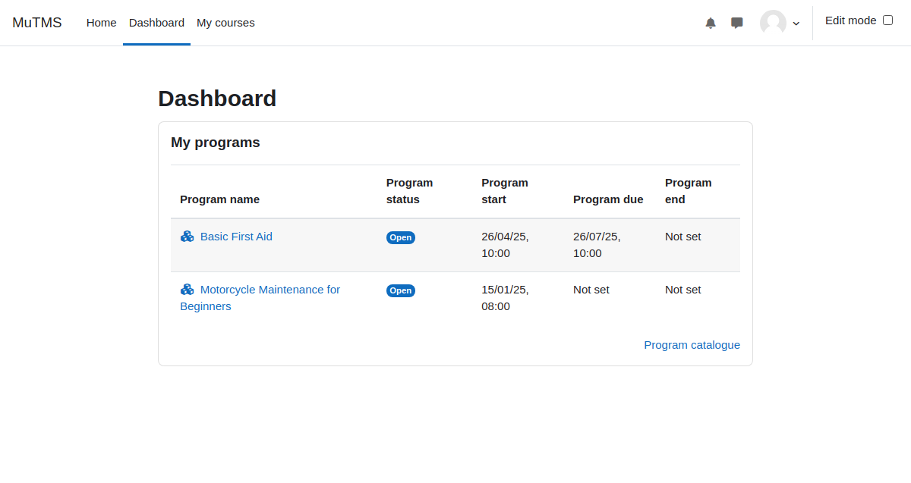

[Programs documentation](index.md) / My programs block

# My programs block

The _My Programs_ block provides users with a convenient way to stay updated on their allocated programs directly
from their dashboard. By adding this block, users can quickly preview all programs they are allocated to, allowing
them to monitor their progress and access programs without navigating through multiple pages.

This feature is particularly useful for users who actively engage with several programs, as it offers an at-a-glance
summary of their learning journey. The block displays key information about programs, such as their names and links
to program details, facilitating seamless navigation and efficient tracking of individual progress.

  
