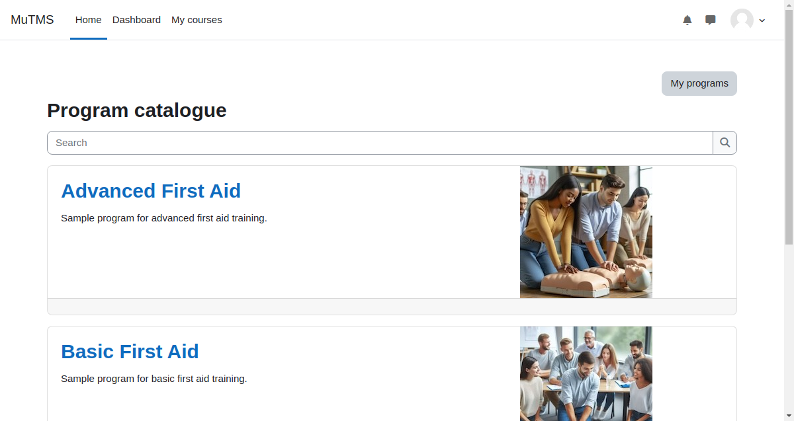

[Programs documentation](index.md) / Program catalogue

# Program catalogue

The Program catalogue serves as a central platform where students can explore and interact with available programs
and their associated courses. It supports multiple allocation sources, providing flexibility in how users are assigned
to programs. Users can browse programs and, depending on the program's settings, may have various options to join or
interact with the program.

The Program catalogue can be accessed from users' [My programs profile page](profile_my_programs.md), making it an
integrated part of the user experience.

Program visibility in the catalogue is managed through the [Program management interface](management_program_visibility.md).
Please note that archived programs are not visible in the catalogue. The catalogue always adheres to tenant separation rules.  

