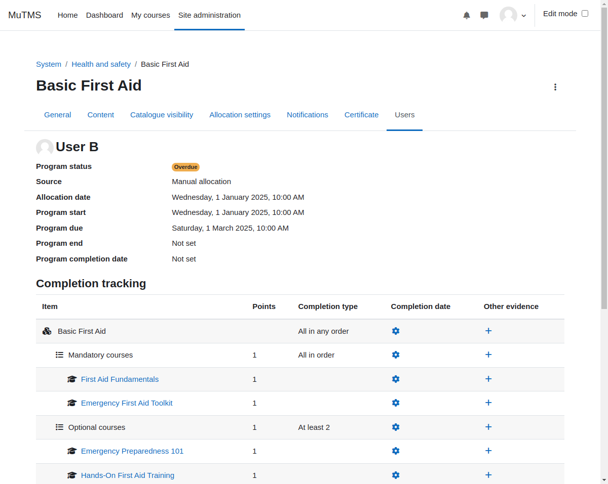

[Programs documentation](index.md) / [Program management](management_index.md) / [Program users](management_program_users.md) / User allocation

# User allocation

The user allocation page provides a detailed view of user allocation records and program progress, offering administrators
or managers insights into each user's engagement within a program.

During user allocation, suspended course enrolments are created for all associated program courses. These enrolments are
automatically activated, and roles are assigned based on program sequencing rules. This mechanism ensures that students
cannot access program courses before the program start date or after the program end date.

There are five key dates associated with each user allocation:

1. **Program allocation date**: Serves as a record of the allocation and acts as the base for calculating all other relative dates.
2. **Program start date**: Defines when the user gains access to program courses.
3. **Program due date**: An optional target completion date for the program. If the program is not completed by this date, it is marked as overdue for the user.
4. **Program end date**: An optional closing date for the program.
5. **Program completion date**: Indicates the program completion date for the user. If empty, it means the program is not yet completed.

Dates 2–4 are calculated automatically during user allocation based on the [program allocation settings](management_program_allocation.md). However,
with the exception of the allocation date, these dates can be manually updated later if needed.

  
