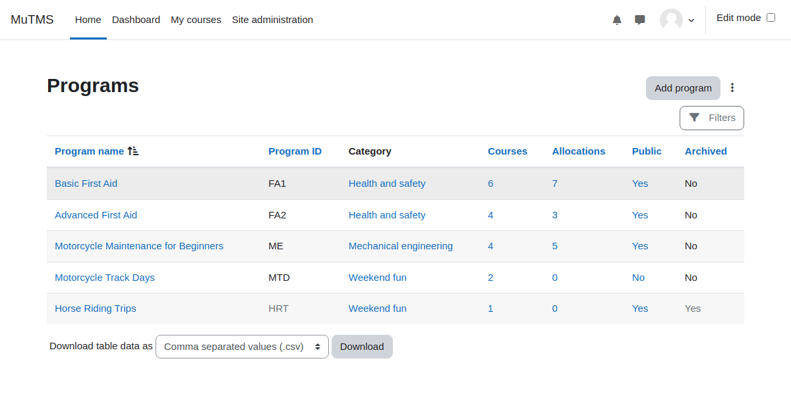

[Programs documentation](index.md) / Program management

# Program management

* [Program settings](management_program.md)
* [Program content](management_program_content.md)
* [Catalogue visibility](management_program_visibility.md)
* [Program allocation settings](management_program_allocation.md)
* [Program users](management_program_users.md)
   * [User allocation](management_allocation.md)

Programs can be created at either the system or course category context levels. Access to the program management
interface is, by default, limited to users with Manager or Editing teacher roles.

## Accessing Program management

* **Site Managers** can reach the program management interface via: **Site administration > Programs > Program management**
* Users with the **View program management** capability in system context may use an alternative route:
  * Click on the **Program catalogue** link located within the My Programs profile page or dashboard block.
  * Then, press **Program management** button.
* Users with **View program management** capability in a specific category only can use a workaround:
  * Navigate to the relevant course category management or browsing page.
  * Click _Programs_ link in the secondary navigation menu.

## Overview of management capabilities

Program management capabilities define the level of access and permissions for different operations. Below are the key capabilities:

| **Capability**                     | **Description**                                                                                    |
|------------------------------------|----------------------------------------------------------------------------------------------------|
| View program management            | Browse programs at the system or course category level, view program details, and allocated users. |
| Add and update programs            | Create new programs and modify the settings of existing ones.                                      |
| Clone program content and settings | Clone content and settings from one program into another program.                                  |
| Export programs                    | Export program content and settings.                                                               |
| Upload programs                    | Upload programs, their content and settings.                                                       |
| Add course to programs             | Course-level capability, allows user to add course to program.                                     |
| Delete programs                    | Delete programs and all associated user allocations.                                               |
| Allocate users to programs         | Allocate users manually and restore archived allocation. Depends on allocation source logic.       |
| De-allocate users from programs    | Manually remove user allocations and archive allocations. Depends on allocation source logic.      |
| Manage user allocations            | Update user allocation start, due and end dates.                                                   |
| Manage other completion evidence   | Provide alternative completion evidence for courses or course sets.                                |
| Reset program progress             | Reset users' program progress by purging course data and completions.                              |
| Add program to certifications      | Use program in certification periods.                                                              |
| Configure program custom fields    | System level capability, configure program custom fields.                                          | 
| Advanced program administration    | Carry out specialized, high-risk operations related to programs and allocations.                   |
