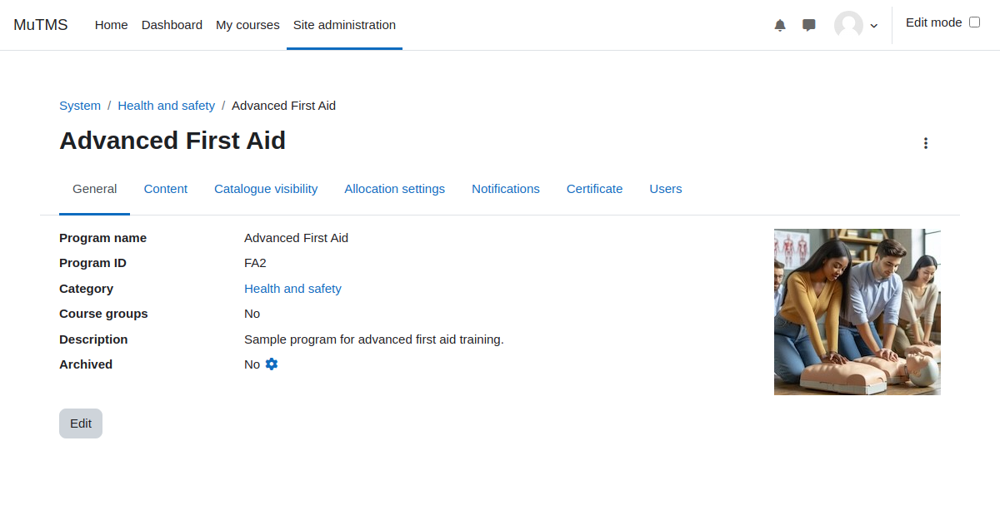

[Programs documentation](index.md) / [Program management](management_index.md) / Program settings

# Program settings

Programs are identified by their names and unique ID numbers. They can be created either within the system context
or at the category context level.

When the course groups option is used with a separate group mode, it allows enrolment responsibilities to be delegated
to different trainers. This ensures that each trainer can only manage the group they are responsible for.

Entire programs or specific user allocations can be set to an archived status. Archiving halts user progress in program
courses and removes the program from both the catalogue and the students' view.

