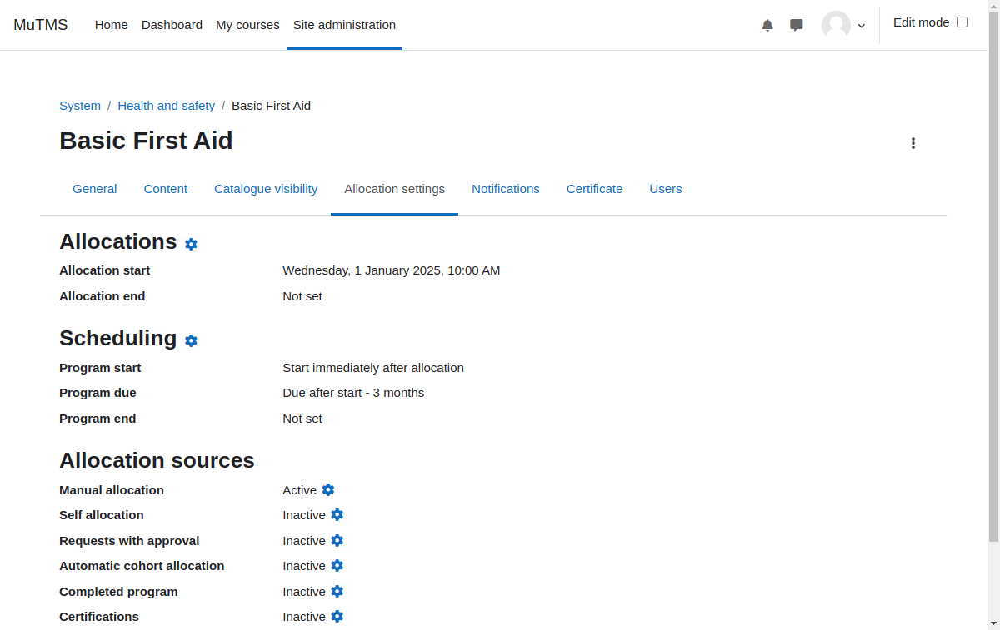

[Programs documentation](index.md) / [Program management](management_index.md) / Program allocation Settings

# Program allocation Settings

Program allocation functions similarly to course enrolment, with the program enrolment plugin fully managing user
enrolments in courses, including suspensions and unenrolments.

The term "allocation" was deliberately chosen to emphasize that it is distinct from course enrolment. The Programs
plugin handles automatic enrolment, suspension, and unenrolment for courses that are part of a program.

Courses referenced through training frameworks must establish enrolments independently of programs.

The program allocation settings define formulas for calculating the following dates during user allocation:
1. **Program start date**: required; calculated relative to the allocation date or set as a fixed date.
2. **Program due date**: optional; calculated relative to the start date or set as a fixed date.
3. **Program end date**: optional; calculated relative to the start date or set as a fixed date.

Additionally, depending on allocation sources program allocations may be constrained by allocation start
and end dates if specified.

## Allocation sources

Students may be allocated to programs through the following sources:

- **Manual allocation**: A manager with the _Allocate users to programs_ capability in program context may manually allocate users.
- **Self-allocation**: Users can self-allocate by clicking a button in the Program catalogue. An optional access key and maximum user limit may be applied.
- **Request with approval**: Users can request allocation via the Program catalogue, subject to approval by a manager.
- **Automatic cohort allocation**: All members of specified cohorts are automatically allocated to the program.
- **Completed program**: All users that complete referenced program are allocated automatically.
- **Certifications**: Allocation is managed indirectly through the Certifications plugin.

During user allocation, a custom program schedule is generated for each user based on program allocation settings.
This schedule includes the program start date, as well as optional program due and end dates.

