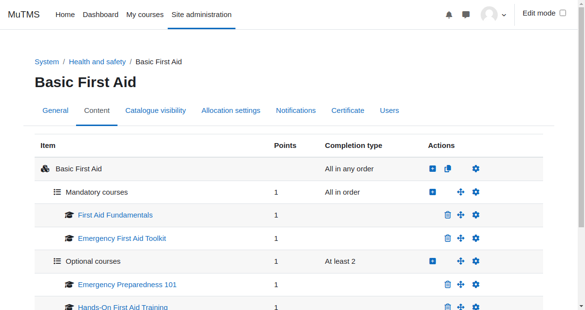

[Programs documentation](index.md) / [Program management](management_index.md) / Program content

# Program content

## Program structure and completion criteria

Program content is organized into a hierarchical course set structure. Each course set may include individual courses,
training frameworks, or other nested course sets.

Completion of a course set can follow one of the following criteria:
- **All in any order**: All components must be completed, but the order does not matter.
- **All in order**: All components must be completed in a specified sequence.
- **At least X**: A minimum number of items must be completed.
- **Minimum X points**: A minimum point threshold must be achieved.

A program is considered complete when the top-level course set has been successfully completed.

Program content should remain unchanged once users are allocated to a program. If a user is unallocated from a program,
their course data may be lost as a result of unenrollment.

