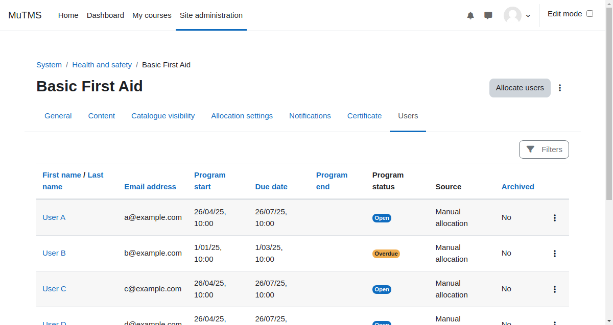

[Programs documentation](index.md) / [Program management](management_index.md) / Program users

# Program users

The allocated users page provides a comprehensive overview of all users' progress within a program.
It allows managers to easily monitor user allocations and track their advancement in one centralized view.

For detailed information, individual [user allocation](management_allocation.md) details can be accessed by clicking on the
corresponding user links, offering insights into their specific progress and schedule.

