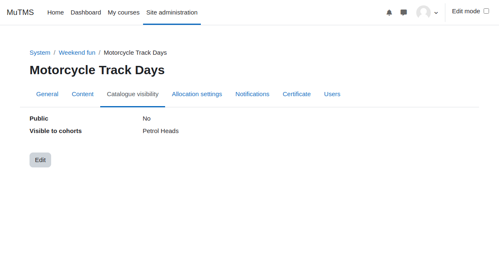

[Programs documentation](index.md) / [Program management](management_index.md) / Catalogue visibility

# Catalogue visibility

Program visibility in the catalogue is not influenced by roles, capabilities, or contexts. Instead, it can be restricted
through cohort membership or made publicly accessible to all users. If a user can view a program, they will also have access
to information about its associated courses, even if those courses are hidden elsewhere.

Archived programs are never visible in the Program catalogue.

Students can use the Program catalogue to explore available programs and their relevant courses. Certain programs may allow
users to self-allocate directly through the Program catalogue. Alternatively, standard course enrollment methods can be
utilized instead of program allocation sources.

Program visibility in the catalogue is managed through the following settings:
- **Public flag**: When set to Yes, all site users can view the program in the catalogue. Tenant separation is strictly enforced if multitenancy is active.
- **Visible to cohorts**: Only members of specified cohorts can view the program in the catalogue.

Users can see all programs they are allocated to in the Program catalogue regardless of the visibility settings described above.

The _My Programs_ profile page and block display all programs users are allocated to, regardless of their visibility
settings, unless the program is marked as archived.

The program management interface uses the dedicated capability _View programs management_, which operates within
the program context. This capability is not intended for student roles.
