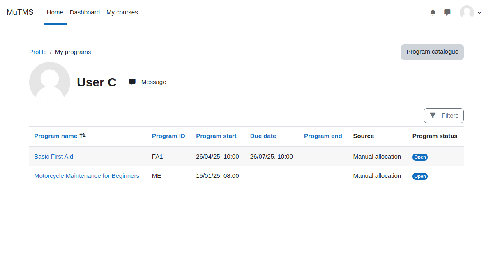
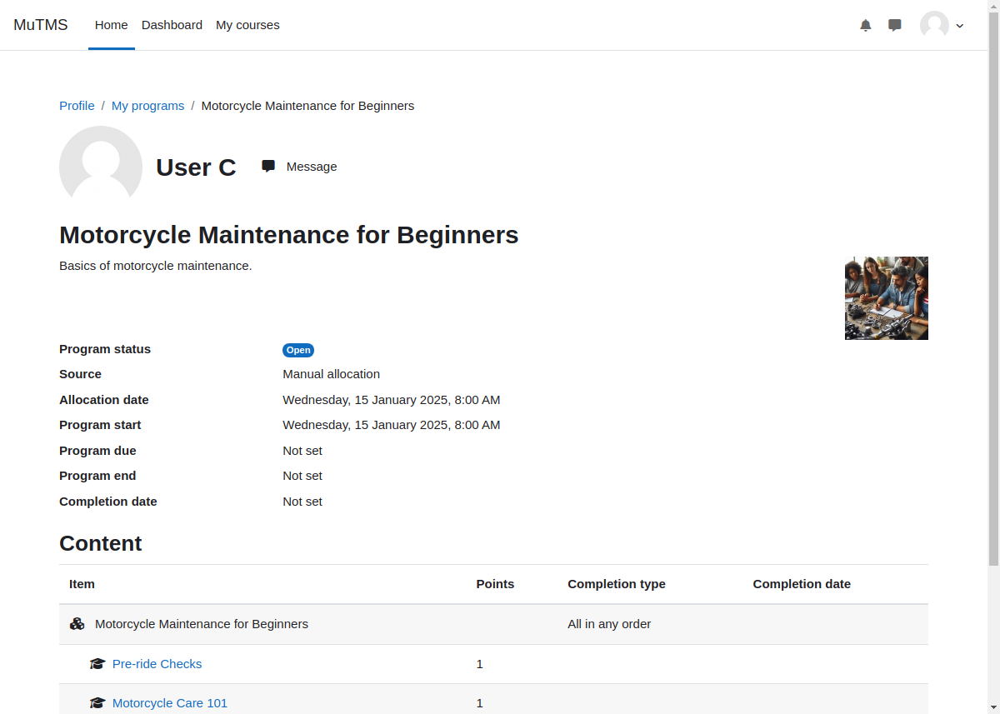

[Programs documentation](index.md) / My programs page

# My programs page

The _My Programs_ page on the profile allows users to view all programs they are allocated to.
Programs will not appear if their allocation or the program itself is marked as archived.

Users can track their progress in individual programs by following the respective program links.

