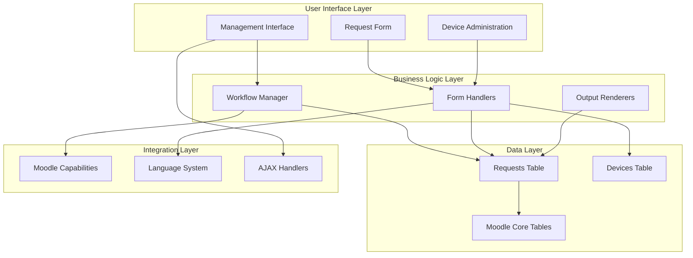

# Plugin Overview - Computer Service Plugin

This document provides a comprehensive overview of the Computer Service plugin's architecture, features, and design principles.

## 🎯 Purpose and Goals

### Primary Purpose
The Computer Service plugin enables educational institutions to manage IT hardware device requests through a structured, workflow-based approval system. It bridges the gap between teachers who need equipment and administrators who manage device allocation.

### Key Goals
- **Streamline device requests**: Simplify the process of requesting IT equipment
- **Ensure proper approval**: Implement multi-level approval workflows
- **Improve transparency**: Provide clear status tracking and rejection reasons
- **Support multilingual environments**: Full Arabic and English support
- **Integrate with Moodle**: Leverage existing user roles and permissions

### Target Users
- **Teachers/Instructors**: Request devices for their courses
- **Department Heads**: Review and approve departmental requests
- **IT Managers**: Manage device availability and final approvals
- **System Administrators**: Configure and maintain the system

## 🏗️ Architecture Overview

### Plugin Type: Local Plugin
The Computer Service plugin is implemented as a Moodle **local plugin**, which provides:
- System-wide availability
- Integration with Moodle's core features
- Access to user management and permissions
- Ability to extend navigation and functionality

### Component Architecture



### Design Patterns

#### MVC Pattern
- **Models**: Database operations and data validation
- **Views**: Mustache templates and output renderers  
- **Controllers**: Page handlers and AJAX endpoints

#### Factory Pattern
- Workflow manager creates appropriate status transitions
- Form factory generates different form types
- Output factory prepares data for templates

#### Observer Pattern
- Status changes trigger appropriate actions
- User actions generate audit trails
- Database updates cascade to related records

## 🔧 Core Components

### 1. Workflow Engine

#### `simple_workflow_manager` Class
The heart of the approval system that:
- Manages status transitions
- Enforces business rules
- Validates user permissions
- Handles approval/rejection logic

#### Workflow States
```php
STATUS_INITIAL        = 15  // Initial submission
STATUS_LEADER1_REVIEW = 16  // Department head review
STATUS_LEADER2_REVIEW = 17  // Faculty manager review
STATUS_LEADER3_REVIEW = 18  // Administrative review
STATUS_BOSS_REVIEW    = 19  // Executive approval
STATUS_APPROVED       = 20  // Final approval
STATUS_REJECTED       = 21  // Legacy rejection status (rejections now go to initial)
```

#### State Transitions
- **Linear progression**: Each approval moves to next stage
- **Rejection branches**: Any stage can reject back to initial state
- **Validation**: Each transition validates user capabilities
- **Auditing**: All transitions are logged with timestamps

### 2. Form System

#### Request Form (`request_form.php`)
- **Dynamic course loading**: Shows only user's enrolled courses
- **Device filtering**: Displays only active devices
- **Date validation**: Ensures future dates only
- **urgent detection**: Auto-flags urgent requests
- **Multilingual support**: Labels in user's language

#### Filter Form (`filter_form.php`)
- **Course filtering**: Filter by specific courses
- **User search**: Find requests by user name
- **Status filtering**: Show requests in specific states
- **Urgency filtering**: Filter by urgent vs non-urgent requests
- **Reset functionality**: Clear all filters easily

#### Device Form (`device_form.php`)
- **Bilingual input**: English and Arabic device names
- **Status control**: Set initial active/inactive state
- **Validation**: Ensures both language variants provided

### 3. Data Model

#### Database Schema
```sql
-- Main requests table
local_computerservice_requests
├── id (Primary Key)
├── userid (FK to mdl_user)
├── courseid (FK to mdl_course)  
├── deviceid (FK to local_computerservice_devices)
├── status_id (Workflow status)
├── numdevices (Quantity requested)
├── request_needed_by (Required date)
├── is_urgent (Auto-calculated flag)
├── comments (User notes)
├── rejection_note (Rejection reason)
├── approval_note (Approval notes)
├── timecreated (Creation timestamp)
└── timemodified (Last update timestamp)

-- Device types table
local_computerservice_devices
├── id (Primary Key)
├── devicename_en (English name)
├── devicename_ar (Arabic name)
└── status (active/inactive)
```

#### Relationships
- **One-to-Many**: User → Requests
- **One-to-Many**: Course → Requests
- **One-to-Many**: Device Type → Requests
- **Many-to-One**: Requests → Workflow Status

### 4. User Interface

#### Tabbed Navigation
```php
Tab 1: Request Devices    // Form for submitting requests
Tab 2: Manage Requests    // Table for approval/rejection  
Tab 3: Manage Devices     // Admin interface for device types
```

#### AJAX Integration
- **Real-time updates**: Status changes without page refresh
- **Immediate feedback**: Success/error messages
- **Session validation**: CSRF protection for all actions
- **Progressive enhancement**: Works with JavaScript disabled

#### Responsive Design
- **Mobile-friendly**: Works on all screen sizes
- **Accessibility**: Proper ARIA labels and keyboard navigation
- **Print-friendly**: Optimized for printing reports

## 🌐 Multilingual Architecture

### Language Resolution Strategy
```php
// Dynamic language selection
$lang = current_language();
$device_name = ($lang === 'ar') ? $device->devicename_ar : $device->devicename_en;
```

### Language File Structure
```
/lang/
├── en/local_computerservice.php    // English strings
└── ar/local_computerservice.php    // Arabic strings
```

### RTL Support
- Arabic text displays right-to-left
- Interface elements adapt to text direction
- Device names stored separately for each language
- Form labels and messages fully translated

### Language Features
- **Automatic detection**: Uses Moodle's language system
- **Fallback mechanism**: Defaults to English if translation missing
- **Customizable**: Administrators can modify translations
- **Extensible**: Easy to add new languages

## 🔐 Security Architecture

### Multi-Layer Security

#### 1. Authentication Layer
- **Moodle Integration**: Uses existing user authentication
- **Session Management**: Leverages Moodle's session handling
- **Login Requirements**: All features require authentication

#### 2. Authorization Layer
- **Capability System**: Granular permission control
- **Role-based Access**: Different access levels for different roles
- **Context-aware**: Permissions checked in appropriate contexts

#### 3. Input Validation Layer
- **Parameter Validation**: All inputs validated and typed
- **SQL Injection Prevention**: Parameterized queries only
- **XSS Protection**: Output sanitization and escaping

#### 4. Session Security Layer
- **CSRF Protection**: Session keys required for state changes
- **AJAX Validation**: All AJAX requests validate session keys
- **Race Condition Prevention**: Timestamp-based updates

### Capability Framework
```php
// Capability hierarchy
local/computerservice:submitrequest        // Basic request submission
local/computerservice:managerequests       // Global management
local/computerservice:manage_devices       // Device administration
local/computerservice:approve_leader1      // First level approval
local/computerservice:approve_leader2      // Second level approval
local/computerservice:approve_leader3      // Third level approval
local/computerservice:approve_boss         // Boss level approval
local/computerservice:approve_final        // Final approval
```

## 📊 Performance Considerations

### Database Optimization

#### Indexing Strategy
- **Primary Keys**: Fast record lookup
- **Foreign Keys**: Efficient joins
- **Status Fields**: Quick filtering
- **Composite Indexes**: Multi-column searches

#### Query Optimization
- **Specific Selects**: Avoid SELECT * queries
- **Efficient Joins**: Proper join conditions
- **Result Limiting**: Pagination for large datasets
- **Caching**: Leverage Moodle's caching system

### Frontend Performance

#### AJAX Benefits
- **Reduced Page Loads**: Status changes don't require full reload
- **Better User Experience**: Immediate feedback
- **Lower Server Load**: Smaller request payloads

#### Template Optimization
- **Mustache Caching**: Templates cached automatically
- **Minimal DOM**: Efficient HTML structure
- **Progressive Loading**: Load content as needed

### Scalability Considerations

#### Database Scaling
- **Partitioning**: Consider partitioning by date for large datasets
- **Archiving**: Regular cleanup of old requests
- **Read Replicas**: Separate read/write operations if needed

#### Application Scaling
- **Stateless Design**: No server-side state dependencies
- **Caching**: Extensive use of Moodle's caching
- **Lazy Loading**: Load components only when needed

## 🔄 Integration Points

### Moodle Core Integration

#### User Management
- **Authentication**: Uses Moodle login system
- **User Data**: Leverages existing user profiles
- **Role System**: Integrates with Moodle roles and capabilities

#### Course Integration
- **Course Enrollment**: Filters courses by user enrollment
- **Course Context**: Links requests to specific courses
- **Academic Structure**: Respects course organization

#### Navigation Integration
- **Settings Menu**: Adds links for authorized users
- **Direct Access**: Plugin accessible via URL
- **Breadcrumb**: Proper navigation hierarchy

### External System Integration

#### Potential Integrations
- **Asset Management**: Sync with external inventory systems
- **Email Systems**: Notifications and alerts
- **Calendar Systems**: Schedule device availability
- **Reporting Tools**: Export data for analysis

#### API Considerations
- **RESTful Design**: Clean API endpoints
- **JSON Responses**: Standard data format
- **Authentication**: API key or OAuth integration
- **Rate Limiting**: Prevent abuse

## 🎨 User Experience Design

### Design Principles

#### Simplicity
- **Minimal Clicks**: Reduce steps to complete tasks
- **Clear Labels**: Descriptive form labels and buttons
- **Logical Flow**: Intuitive navigation and progression

#### Feedback
- **Immediate Response**: AJAX provides instant feedback
- **Clear Status**: Visual indicators for request states
- **Error Messages**: Helpful error descriptions

#### Accessibility
- **Keyboard Navigation**: Full keyboard support
- **Screen Readers**: Proper ARIA labels
- **Color Contrast**: High contrast for readability
- **Text Scaling**: Responsive to browser zoom

### Interface Patterns

#### Progressive Disclosure
- **Tabbed Interface**: Organize features logically
- **Expandable Sections**: Show details on demand
- **Modal Dialogs**: Focused interactions

#### Consistent Styling
- **Moodle Theme**: Inherits site appearance
- **Color Coding**: Consistent status colors
- **Icon Usage**: Standard iconography

## 🔮 Future Architecture

### Planned Enhancements

#### Advanced Workflow
- **Parallel Approvals**: Multiple approvers at same level
- **Conditional Routing**: Different paths based on criteria
- **Time-based Rules**: Auto-escalation and deadlines

#### Enhanced Integration
- **Calendar Integration**: Schedule and booking system
- **Notification System**: Email and push notifications
- **Mobile App**: Native mobile application

#### Analytics and Reporting
- **Usage Analytics**: Track request patterns
- **Performance Metrics**: Workflow efficiency analysis
- **Predictive Analytics**: Forecast device demand

### Extensibility Design

#### Plugin Architecture
- **Event System**: Trigger custom actions
- **Hook Points**: Allow custom modifications
- **Configuration API**: Programmatic configuration
- **Theme Override**: Custom styling options

#### API Development
- **Public API**: External system integration
- **Webhook Support**: Real-time event notifications
- **GraphQL**: Flexible data querying
- **Documentation**: Comprehensive API docs

---

This overview provides the foundation for understanding how the Computer Service plugin is architected and how its various components work together to provide a robust device request management system. 