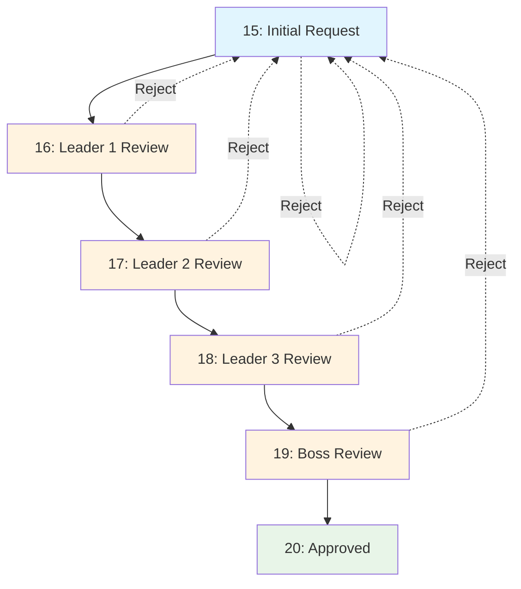

# Workflow System Documentation

This document explains how the Computer Service plugin's approval workflow system works, including the technical implementation and user experience.

## 🔄 Workflow Overview

The Computer Service plugin uses a multi-step approval workflow that moves requests through various stages from initial submission to final approval or rejection.

### Workflow Philosophy
- **Linear progression**: Requests move forward through defined stages
- **Rejection at any stage**: Requests can be rejected at any approval step
- **Transparency**: All rejection reasons are preserved and visible
- **Security**: Each action requires proper capabilities and session validation
- **Audit trail**: All status changes are timestamped and tracked

## 📊 Workflow States

### Status Definitions

```php
// Workflow status constants (simple_workflow_manager.php)
const STATUS_INITIAL        = 15;  // Initial request submission
const STATUS_LEADER1_REVIEW = 16;  // First leader review
const STATUS_LEADER2_REVIEW = 17;  // Second leader review  
const STATUS_LEADER3_REVIEW = 18;  // Third leader review
const STATUS_BOSS_REVIEW    = 19;  // Final boss review
const STATUS_APPROVED       = 20;  // Request approved
const STATUS_REJECTED       = 21;  // Legacy rejection status (rejections now go to initial)
```

### Workflow Progression Diagram



### State Descriptions

| Status | Name | Description | Available Actions | Required Capability |
|--------|------|-------------|------------------|-------------------|
| 15 | Initial | Request submitted by user | Approve → 16, Reject → 15 | `managerequests` or `approve_leader1` |
| 16 | Leader 1 Review | First level approval | Approve → 17, Reject → 15 | `managerequests` or `approve_leader2` |
| 17 | Leader 2 Review | Second level approval | Approve → 18, Reject → 15 | `managerequests` or `approve_leader3` |
| 18 | Leader 3 Review | Third level approval | Approve → 19, Reject → 15 | `managerequests` or `approve_boss` |
| 19 | Boss Review | Final approval level | Approve → 20, Reject → 15 | `managerequests` or `approve_final` |
| 20 | Approved | Request approved | View only | None |
| 21 | Rejected | Request rejected (legacy status) | View rejection note | None |

## 🏗️ Technical Implementation

### Core Workflow Class: `simple_workflow_manager`

Location: `/classes/simple_workflow_manager.php`

#### Key Methods

##### `get_initial_status_id()`
```php
public static function get_initial_status_id() {
    return self::STATUS_INITIAL;
}
```
- Returns the starting status for new requests
- Used when creating new requests

##### `approve_request($requestid, $userid, $sesskey, $approval_note = '')`
```php
public static function approve_request($requestid, $userid, $sesskey, $approval_note = '') {
    // 1. Validate session key
    if (!confirm_sesskey($sesskey)) {
        return ['success' => false, 'error' => 'Invalid session key'];
    }
    
    // 2. Get current request data
    $request = $DB->get_record('local_computerservice_requests', ['id' => $requestid]);
    
    // 3. Check user capabilities
    if (!self::can_user_manage_status($userid, $request->status_id)) {
        return ['success' => false, 'error' => 'Insufficient permissions'];
    }
    
    // 4. Calculate next status
    $next_status = self::get_next_status($request->status_id);
    
    // 5. Update database with race condition protection
    $update = [
        'id' => $requestid,
        'status_id' => $next_status,
        'timemodified' => time()
    ];
    
    if (!empty($approval_note)) {
        $update['approval_note'] = $approval_note;
    }
    
    $DB->update_record('local_computerservice_requests', (object)$update);
    
    return ['success' => true, 'new_status' => $next_status];
}
```

##### `reject_request($requestid, $userid, $sesskey, $rejection_note)`
```php
public static function reject_request($requestid, $userid, $sesskey, $rejection_note) {
    // 1. Validate inputs
    if (!confirm_sesskey($sesskey)) {
        return ['success' => false, 'error' => 'Invalid session key'];
    }
    
    if (empty(trim($rejection_note))) {
        return ['success' => false, 'error' => 'Rejection note is required'];
    }
    
    // 2. Capability check
    $request = $DB->get_record('local_computerservice_requests', ['id' => $requestid]);
    if (!self::can_user_manage_status($userid, $request->status_id)) {
        return ['success' => false, 'error' => 'Insufficient permissions'];
    }
    
    // 3. Update to initial status (rejection moves back to start)
    $update = [
        'id' => $requestid,
        'status_id' => self::STATUS_INITIAL,
        'rejection_note' => trim($rejection_note),
        'timemodified' => time()
    ];
    
    $DB->update_record('local_computerservice_requests', (object)$update);
    
    return ['success' => true, 'new_status' => self::STATUS_INITIAL];
}
```

##### `get_next_status($current_status)`
```php
public static function get_next_status($current_status) {
    switch ($current_status) {
        case self::STATUS_INITIAL:
            return self::STATUS_LEADER1_REVIEW;
        case self::STATUS_LEADER1_REVIEW:
            return self::STATUS_LEADER2_REVIEW;
        case self::STATUS_LEADER2_REVIEW:
            return self::STATUS_LEADER3_REVIEW;
        case self::STATUS_LEADER3_REVIEW:
            return self::STATUS_BOSS_REVIEW;
        case self::STATUS_BOSS_REVIEW:
            return self::STATUS_APPROVED;
        default:
            throw new moodle_exception('Invalid status for approval');
    }
}
```

### AJAX Handler: `update_request_status.php`

Location: `/actions/update_request_status.php`

#### Request Processing
```php
// 1. AJAX script definition
define('AJAX_SCRIPT', true);
require_once('../../../config.php');

// 2. Parameter extraction and validation
$requestid = required_param('requestid', PARAM_INT);
$action = required_param('action', PARAM_ALPHA);
$sesskey = required_param('sesskey', PARAM_RAW);

// 3. Session validation
if (!confirm_sesskey($sesskey)) {
    die(json_encode(['success' => false, 'error' => 'Invalid session key']));
}

// 4. Route to appropriate workflow method
if ($action === 'approve') {
    $approval_note = optional_param('approval_note', '', PARAM_TEXT);
    $result = simple_workflow_manager::approve_request($requestid, $USER->id, $sesskey, $approval_note);
} elseif ($action === 'reject') {
    $rejection_note = required_param('rejection_note', PARAM_TEXT);
    $result = simple_workflow_manager::reject_request($requestid, $USER->id, $sesskey, $rejection_note);
}

// 5. Return JSON response
header('Content-Type: application/json');
echo json_encode($result);
```

## 🔐 Security Features

### Session Key Validation
Every workflow action requires a valid session key to prevent CSRF attacks:

```php
if (!confirm_sesskey($sesskey)) {
    return ['success' => false, 'error' => 'Invalid session key'];
}
```

### Capability-Based Access Control
The workflow implements a two-tier capability system:

#### Primary Capability
- `local/computerservice:managerequests` - Global management permission
- Allows users to approve/reject at any workflow stage
- Fallback permission when specific workflow capabilities aren't assigned

#### Workflow-Specific Capabilities
```php
// Capability mapping for each workflow step
private static function get_capability_for_status($status_id) {
    switch ($status_id) {
        case self::STATUS_INITIAL:
            return 'local/computerservice:approve_leader1';
        case self::STATUS_LEADER1_REVIEW:
            return 'local/computerservice:approve_leader2';
        case self::STATUS_LEADER2_REVIEW:
            return 'local/computerservice:approve_leader3';
        case self::STATUS_LEADER3_REVIEW:
            return 'local/computerservice:approve_boss';
        case self::STATUS_BOSS_REVIEW:
            return 'local/computerservice:approve_final';
        default:
            return null;
    }
}
```

#### Permission Check Logic
```php
public static function can_user_manage_status($userid, $status_id) {
    $context = context_system::instance();
    
    // Check global management capability first
    if (has_capability('local/computerservice:managerequests', $context, $userid)) {
        return true;
    }
    
    // Check workflow-specific capability
    $specific_capability = self::get_capability_for_status($status_id);
    if ($specific_capability && has_capability($specific_capability, $context, $userid)) {
        return true;
    }
    
    return false;
}
```

### Race Condition Prevention
The workflow protects against race conditions by:

1. **Timestamp validation**: Checking `timemodified` before updates
2. **Atomic operations**: Using single database updates
3. **Session validation**: Ensuring requests come from valid sessions
4. **Status validation**: Verifying current status before transitions

## 🎨 User Interface Integration

### AJAX-Based Actions
The workflow provides real-time feedback without page reloads:

#### JavaScript Integration
```javascript
// In manage_requests.mustache template
function approveRequest(requestId) {
    $.ajax({
        url: M.cfg.wwwroot + '/local/computerservice/actions/update_request_status.php',
        type: 'POST',
        data: {
            requestid: requestId,
            action: 'approve',
            sesskey: M.cfg.sesskey,
            approval_note: $('#approval_note_' + requestId).val()
        },
        success: function(response) {
            if (response.success) {
                updateStatusDisplay(requestId, response.new_status);
                showSuccessMessage('Request approved successfully');
            } else {
                showErrorMessage(response.error);
            }
        },
        error: function() {
            showErrorMessage('Network error occurred');
        }
    });
}

function rejectRequest(requestId) {
    var rejectionNote = $('#rejection_note_' + requestId).val();
    if (!rejectionNote.trim()) {
        showErrorMessage('Rejection note is required');
        return;
    }
    
    $.ajax({
        url: M.cfg.wwwroot + '/local/computerservice/actions/update_request_status.php',
        type: 'POST',
        data: {
            requestid: requestId,
            action: 'reject',
            sesskey: M.cfg.sesskey,
            rejection_note: rejectionNote
        },
        success: function(response) {
            if (response.success) {
                updateStatusDisplay(requestId, response.new_status);
                showSuccessMessage('Request rejected');
            } else {
                showErrorMessage(response.error);
            }
        }
    });
}
```

### Status Display
The interface provides visual feedback for workflow states:

#### Color-Coded Status Badges
```mustache
{{#requests}}
<span class="badge badge-{{status_class}}">
    {{status_name}}
</span>
{{/requests}}
```

#### Status Class Mapping
```php
// In manage_requests.php renderable class
private function get_status_class($status_id) {
    switch ($status_id) {
        case 15: return 'warning';      // Initial - Yellow
        case 16:
        case 17:
        case 18:
        case 19: return 'info';         // In Review - Blue
        case 20: return 'success';      // Approved - Green
        case 21: return 'danger';       // Rejected - Red
        default: return 'secondary';    // Unknown - Gray
    }
}
```

### Rejection Note Display
When requests are rejected, the rejection note is prominently displayed:

```mustache
{{#rejection_note}}
<div class="alert alert-danger">
    <strong>Rejection Reason:</strong> {{rejection_note}}
</div>
{{/rejection_note}}
```

## 🔄 Workflow Extensions

### Adding New Workflow Steps

#### 1. Define New Status Constants
```php
// In simple_workflow_manager.php
const STATUS_TECHNICAL_REVIEW = 22;  // New technical review step
```

#### 2. Update Workflow Logic
```php
public static function get_next_status($current_status) {
    switch ($current_status) {
        case self::STATUS_INITIAL:
            return self::STATUS_TECHNICAL_REVIEW;  // Insert new step
        case self::STATUS_TECHNICAL_REVIEW:
            return self::STATUS_LEADER1_REVIEW;    // Continue to existing flow
        // ... rest of existing logic
    }
}
```

#### 3. Add Capability Definition
```php
// In db/access.php
'local/computerservice:approve_technical' => array(
    'captype' => 'write',
    'contextlevel' => CONTEXT_SYSTEM,
    'archetypes' => array(
        'manager' => CAP_ALLOW,
    ),
),
```

#### 4. Update Language Strings
```php
// In lang/en/local_computerservice.php
$string['status_technical_review'] = 'Technical Review';

// In lang/ar/local_computerservice.php
$string['status_technical_review'] = 'المراجعة التقنية';
```

### Custom Workflow Actions

#### Example: Auto-Approval for urgent Requests
```php
public static function process_urgent_request($requestid) {
    global $DB;
    
    $request = $DB->get_record('local_computerservice_requests', ['id' => $requestid]);
    
    if ($request->is_urgent && $request->status_id == self::STATUS_INITIAL) {
        // Skip to boss review for urgent requests
        $update = [
            'id' => $requestid,
            'status_id' => self::STATUS_BOSS_REVIEW,
            'approval_note' => 'Auto-advanced due to urgent status',
            'timemodified' => time()
        ];
        
        $DB->update_record('local_computerservice_requests', (object)$update);
        return true;
    }
    
    return false;
}
```

## 📊 Workflow Analytics

### Common Workflow Queries

#### Requests by Status
```sql
SELECT 
    status_id,
    COUNT(*) as request_count,
    AVG(UNIX_TIMESTAMP() - timecreated) as avg_age_seconds
FROM mdl_local_computerservice_requests 
GROUP BY status_id;
```

#### Workflow Bottlenecks
```sql
SELECT 
    status_id,
    COUNT(*) as pending_count,
    MIN(FROM_UNIXTIME(timecreated)) as oldest_request
FROM mdl_local_computerservice_requests 
WHERE status_id NOT IN (20, 21)  -- Not approved or rejected
GROUP BY status_id
ORDER BY pending_count DESC;
```

#### Approval Time Analysis
```sql
SELECT 
    CASE 
        WHEN is_urgent = 1 THEN 'urgent'
        ELSE 'Regular'
    END as request_type,
    AVG(timemodified - timecreated) as avg_approval_time_seconds,
    COUNT(*) as total_requests
FROM mdl_local_computerservice_requests 
WHERE status_id = 20  -- Approved requests
GROUP BY is_urgent;
```

## 🚀 Future Workflow Enhancements

### Potential Improvements

1. **Parallel Approval Paths**
   - Allow multiple approvers at the same level
   - Require consensus or majority approval

2. **Conditional Workflows**
   - Different approval paths based on device type
   - Skip steps for trusted users or departments

3. **Time-Based Rules**
   - Auto-escalation after specified time periods
   - Deadline-based prioritization

4. **Integration Features**
   - Email notifications at each workflow step
   - Calendar integration for approval reminders
   - External system integration (ERP, asset management)

5. **Advanced Analytics**
   - Workflow performance dashboards
   - Approval pattern analysis
   - Predictive analytics for request approval likelihood

### Implementation Considerations

- **Backward Compatibility**: Ensure existing workflows continue to function
- **Performance**: Consider database impact of complex workflow logic
- **User Experience**: Maintain simple interface despite increased complexity
- **Configuration**: Provide admin interface for workflow customization 