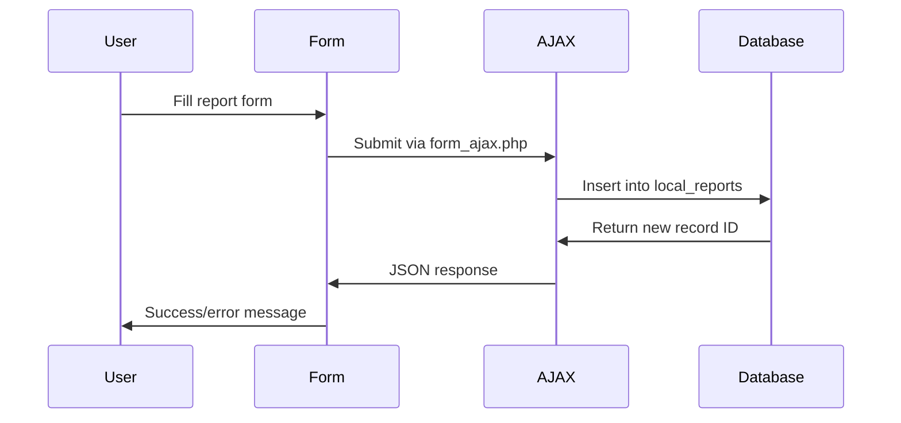

# Database Documentation

This document describes the database schema, data structures, and data flow for the Student Reports plugin.

## Database Tables

### Main Table: `local_reports`

The primary table storing all student report data.

#### Table Structure
```sql
CREATE TABLE `local_reports` (
  `id` bigint(10) NOT NULL AUTO_INCREMENT,
  `userid` bigint(10) NOT NULL,
  `courseid` bigint(10) NOT NULL,
  `futureexpec` longtext,
  `dep_op` longtext,
  `seg_path` longtext,
  `researchtitle` longtext,
  `status_id` bigint(10) NOT NULL DEFAULT '0',
  `type_id` bigint(10) NOT NULL DEFAULT '0',
  `timecreated` bigint(10) NOT NULL,
  `timemodified` bigint(10) NOT NULL,
  `createdby` bigint(10) NOT NULL,
  `modifiedby` bigint(10) NOT NULL,
  PRIMARY KEY (`id`),
  KEY `user_fk` (`userid`),
  KEY `course_fk` (`courseid`),
  KEY `created_fk` (`createdby`),
  KEY `modified_fk` (`modifiedby`),
  KEY `idx_course_user` (`courseid`, `userid`),
  KEY `idx_status` (`status_id`)
);
```

#### Field Descriptions

| Field | Type | Description |
|-------|------|-------------|
| `id` | int(10) | Primary key, auto-increment |
| `userid` | int(10) | Foreign key to `user.id` - student this report is about |
| `courseid` | int(10) | Foreign key to `course.id` - course context |
| `futureexpec` | text | Future expectations field content |
| `dep_op` | text | Department opinion field content |
| `seg_path` | text | Suggested path field content |
| `researchtitle` | text | Research title field content |
| `status_id` | int(10) | Current workflow status (0=draft, 30=pending, 31=in_review, 32=approved, 50=final) |
| `type_id` | int(10) | Report type identifier |
| `timecreated` | int(10) | Unix timestamp when record was created |
| `timemodified` | int(10) | Unix timestamp when record was last modified |
| `createdby` | int(10) | Foreign key to `user.id` - user who created the report |
| `modifiedby` | int(10) | Foreign key to `user.id` - user who last modified the report |

#### Foreign Key Relationships
- `userid` → `user.id` (Student)
- `courseid` → `course.id` (Course)
- `createdby` → `user.id` (Creator)
- `modifiedby` → `user.id` (Last modifier)

#### Indexes
- Primary key on `id`
- Foreign key indexes on user and course relationships
- Composite index on `(courseid, userid)` for efficient course-based queries
- Index on `status_id` for workflow filtering

## Data Flow

### Report Creation Flow
1. **User Input**: Teacher/Manager accesses report form via course interface
2. **Form Submission**: AJAX call to `form_ajax.php`
3. **Validation**: Server-side validation of form data
4. **Database Insert**: New record inserted into `local_reports`
5. **Response**: JSON response with success/error status



### Report Update Flow
1. **Load Existing**: Retrieve report data by ID
2. **Form Population**: Pre-populate form with existing data
3. **User Modification**: User updates form fields
4. **Validation**: Server-side validation
5. **Database Update**: Update existing record
6. **Timestamp Update**: Update `timemodified` and `modifiedby`

### Workflow Status Flow
The `status_id` field follows this progression:

```
0 (Draft) → 30 (Pending) → 31 (Under Review) → 32 (Approved) → 50 (Final)
                ↓
           (Disapproved - can return to earlier status)
```

#### Status Definitions
- **0**: Draft - Report is being created/edited
- **30**: Pending - Submitted for initial review
- **31**: Under Review - Being reviewed by authorized personnel
- **32**: Approved - Approved but not yet final
- **50**: Final - Fully approved and locked

### Approval Workflow Data Changes
When a report moves through the workflow:

1. **Approval Process** (`approve_ajax.php`):
   - Updates `status_id` to next workflow step
   - Updates `timemodified` to current timestamp
   - Updates `modifiedby` to current user ID
   - May trigger notifications or logging

2. **Disapproval Process** (`disapprove_ajax.php`):
   - May reset `status_id` to earlier step
   - Records disapproval reason (possibly in separate table/field)
   - Updates audit fields

## Query Patterns

### Common Database Queries

#### Get Reports for a Course
```php
$reports = $DB->get_records_sql("
    SELECT r.*, u.firstname, u.lastname, u.email
    FROM {local_reports} r
    JOIN {user} u ON r.userid = u.id
    WHERE r.courseid = :courseid
    ORDER BY r.timemodified DESC
", ['courseid' => $courseid]);
```

#### Get Reports by Status
```php
$pending_reports = $DB->get_records('local_reports', [
    'courseid' => $courseid,
    'status_id' => 30
], 'timemodified DESC');
```

#### Get User's Report in Course
```php
$user_report = $DB->get_record('local_reports', [
    'userid' => $userid,
    'courseid' => $courseid
]);
```

#### System-wide Report Query (allreports.php)
```php
$all_reports = $DB->get_records_sql("
    SELECT r.*, u.firstname, u.lastname, c.fullname as coursename
    FROM {local_reports} r
    JOIN {user} u ON r.userid = u.id
    JOIN {course} c ON r.courseid = c.id
    WHERE r.status_id = :status
    ORDER BY r.timemodified DESC
", ['status' => $status_filter]);
```

## Data Validation

### Input Validation Rules
- `userid`: Must be valid existing user ID
- `courseid`: Must be valid existing course ID
- `status_id`: Must be valid workflow status value
- `type_id`: Must be valid report type
- Text fields: Sanitized for HTML/script content
- Timestamps: Generated server-side, not user input

### Business Rules
1. **One Report Per Student Per Course**: Enforced at application level
2. **Workflow Progression**: Status can only move forward (with exceptions for disapproval)
3. **Capability Requirements**: User must have appropriate permissions for each action
4. **Audit Trail**: All changes tracked via timestamp and user fields

## Performance Considerations

### Indexing Strategy
- Composite index on `(courseid, userid)` supports the most common query pattern
- Status index enables efficient filtering of pending/approved reports
- Foreign key indexes support join operations

### Query Optimization
- Use specific field lists instead of `SELECT *` where possible
- Implement pagination for large datasets
- Consider caching for frequently accessed data
- Use prepared statements for repeated queries

### Scaling Considerations
- Table will grow with student count × course count
- Consider partitioning by course or date for very large installations
- Monitor query performance as data volume increases
- Implement archiving strategy for old reports

## Backup and Recovery

### Data Backup
- Include `local_reports` table in regular Moodle backups
- Consider separate backup of report content due to text field sizes
- Test restore procedures regularly

### Data Migration
- Plugin includes proper uninstall procedures
- Data export functionality may be needed for migrations
- Consider data retention policies

## Security Considerations

### Data Protection
- Report content may contain sensitive student information
- Implement proper access controls at database and application level
- Consider encryption for sensitive text fields
- Audit access to report data

### Database Security
- Use parameterized queries to prevent SQL injection
- Implement proper capability checks before data access
- Validate all input parameters
- Use Moodle's built-in security features 